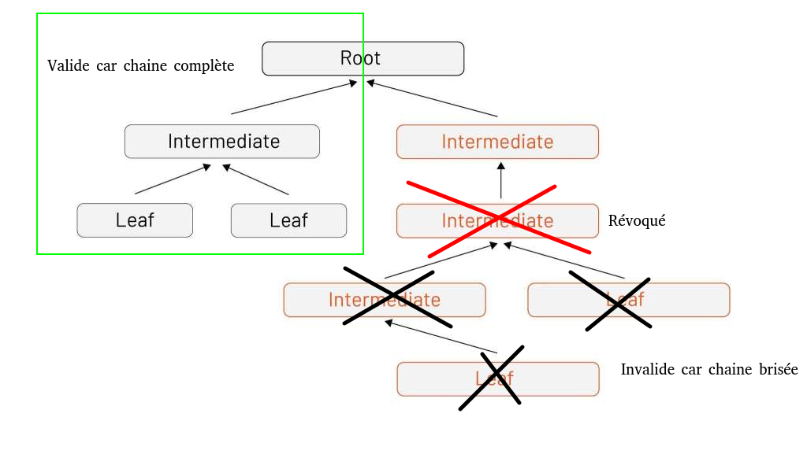
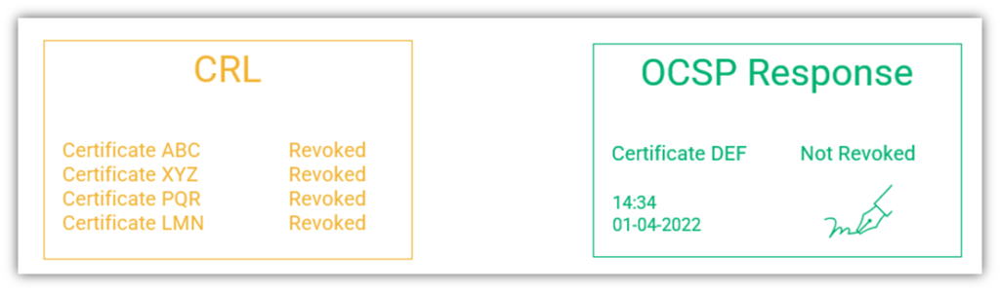

# Politique de gestions des certificats SSL/TLS

- [Politique de gestions des certificats SSL/TLS](#politique-de-gestions-des-certificats-ssltls)
  - [Qu'est-ce qu'un certificat](#quest-ce-quun-certificat)
    - [Définitions](#définitions)
    - [Fonctionnement](#fonctionnement)
  - [Faiblesses du protocole de sécurisation via certificat](#faiblesses-du-protocole-de-sécurisation-via-certificat)
    - [Certificat et chaîne de confiance](#certificat-et-chaîne-de-confiance)
    - [Révocation d'un certificat](#révocation-dun-certificat)
  - [Les règles à respecter](#les-règles-à-respecter)
  - [FAQ](#faq)
    - [Comment savoir si un certificat peut être intermédiaire (apte à signer) ?](#comment-savoir-si-un-certificat-peut-être-intermédiaire-apte-à-signer-)
    - [Vérifier la compatibilité entre le certificat, le CSR et la clé privée](#vérifier-la-compatibilité-entre-le-certificat-le-csr-et-la-clé-privée)

## Qu'est-ce qu'un certificat

### Définitions

Un certificat SSL/TLS est un certificat électronique qui authentifie l'identité d'un site Web et permet une connexion chiffrée. Ce certificat est signé par un tiers de confiance (**Autorité de certification**) qui garantit le lien entre l'identité physique du propriétaire et l'identité numérique du service certifié. La sécurité de la création d'un certificat est basée sur le **chiffrement asymétrique**, notamment l'algorithme RSA.

Un certificat respecte ainsi __4 critères__:

- Infalsifiable
- Nominatif
- Inaltérable
- Irrévocable (cette caractéristique est source de problème !)

Un certificat SSL/TLS  est composé de __3 éléments__:

- Une clé publique pour chiffrer les communications par le client (uniquement déchiffrées par le serveur)
- Des informations liées à l'identité (nom, email, organisation...) et aux caractéristiques du certificat (période de validité...)
- Une signature numérique attestant de son authenticité

### Fonctionnement

- Le client crée une "carte d'identité" contenant les informations de sa structure à certifier (nom, prénom, organisation, email...) et un couple clé privée/publique.
  
- Le client crée un **CSR** (Certificate Signing Request - Demande de signature de certificat) contenant la carte d'identité et la clé publique du client. Le client signe le CSR avec la clé privée et le transmet à l'**Autorité de certification**. Il est important de noter qu'un CSR n'est pas chiffré et peut être lu par tous. La signature garantit l'intégrité (non modification/altération) de la donnée et la source du requérant uniquement.

<p align="center">
  
</p>

- L'Autorité de certification vérifie les données retournées par le CSR et, si validées, elle retourne le certificat signé par sa propre clé privée.

<p align="center">
  
</p>

- Le serveur transmet le certificat au client. Le client vérifie son authenticité en déchiffrant la signature via les clé publiques référencées dans le navigateur/système d'exploitation.

## Faiblesses du protocole de sécurisation via certificat

L'utilisation des certificats est robuste mais présente des faiblesses liées à son aspect inaltérable et son fonctionnement **en chaîne**.

### Certificat et chaîne de confiance

Dans le cas d'une création traditionnelle d'un certificat, l'Autorité de certification signe un certificat (nommé **leaf**) avec la clé privée de son certificat (nommé **root**). Ainsi, le certificat **root** permet de vérifier l'authenticité d'un certificat (clé publique) et de signer des certificats (clé privée). Nous avons ainsi à faire à une chaîne de 2 certificats (2 niveaux).

Dans ce contexte, le certificat *root* est capable de confirmer l'intégrité de tout certificat signé par lui-même. En cas de **fuite de la clé privée du certificat de l'autorité de certification**, le pirate a la capacité de signer un certificat qui sera cru par l'ensemble des clients. De ce fait, il est impératif de protéger au mieux la clé privée du certificat *root*.

Afin de limiter l'exposition du certificat *root* et son utilisation, il est parfois nécessaire de rajouter des niveaux à la chaîne de confiance. Les certificats qui ne sont pas *root* ou *leaf*  sont appelés certificats **intermédiaires**. Ces certificats ont la capacité de signer des certificats *leaf*  (ou d'autres certificats *intermédiaires*) à la place du certificats *root*.

Par exemple, dans l'illustration suivante, nous pouvons observer 2 chaines structurées autour d'un certificat *root*. Le certificat (3) est signé par (2). (2) est signé par (1) et (1) est signé par *root*. Si toutes les signatures sont vérifiées, alors le certificat (3) est validé. Il est **important** de noter que le certificat *root* ne signe pas l'ensemble des certificats *intermédiaires* mais que le certificat suivant dans la chaîne de confiance (dans notre exemple, le certificat (1) ). (1) étant valide, toute signature de ce certificat est valide pour les certificats du niveau suivant, i.e (2) etc... Ainsi, pour qu'une chaîne soit confirmée, il est nécessaire que **toutes les signatures** soient valides. En cas de certificat(s) invalide(s) dans la chaîne de confiance, tout certificat **en dessous** du certificat invalide dans la chaîne ((3) par rapport à (2) par exemple) deviennent invalides.

<p align="center">
  
</p>

<p align="center">
  
</p>

Dans le cadre d'une chaîne, un certificat de niveau N est signé par un certificat *intermédiaire* de niveau N-1. Une exception pour le certificat *root* qui est dit **auto-signé**. Un certificat *auto-signé* se signe **lui-même**. Un certificat *auto-signé* est, par définition, faiblement sécurisé car son origine n'est pas garantie par un tiers de confiance. De ce fait, seuls les certificats *root* des Autorités de certification doivent être reconnus fiables (sauf avis contraire du responsable sécurité).

<p align="center">
  
</p>

Il est parfois possible qu'une politique de certificats auto-signés soit appliquée au sein d'un réseau privé. Le certificat *root* est alors contrôlé par l'administrateur du réseau. Néanmoins, ce certificat d'autorité doit être manuellement ajouté sur chaque périphérique, notamment les navigateurs WEB configurés pour ne croire que les Autorités de certification reconnus.

Cette situation est répandue au sein des SI d'entreprise qui gèrent en interne leur propre sécurité. Néanmoins, en cas de service exposé sur Internet, l'utilisation d'un certificat reconnu par une Autorité de certification est nécessaire car un externe à l'entreprise n'est pas tenu de "croire" (**et il ne devrait pas**) la validité du certificat auto-signé proposé par l'entreprise.

### Révocation d'un certificat

Par définition, un certificat signé n'est pas révocable car la signature est toujours valide tant que le certificat d'autorité est reconnu valide. Cette caractéristique pose problème en cas de compromission d'un certificat.

En effet, en cas de fuite d'une clé privée d'un certificat, il est nécessaire de pouvoir le révoquer afin d'éviter qu'il puisse être utilisé pour déchiffrer des communications ou signer des certificats illicites.

Pour pallier à ce problème, deux protocoles ont été développés: **OCSP** et **CRL**.

- *CRL* (Certificate Revocation List) met en place une liste de révocation de certificats, i.e une liste noire de l'autorité de certification où sont listés tous les certificats révoqués. Lors de la vérification d'un certificat, le navigateur télécharge la *CRL* auprès de l'Autorité de certification et vérifie l'état du certificat via cette liste.

  Cependant, cette approche entraîne une charge réseau importante et peut être source de lenteur pour le client ou d'attaque réseau sur l'Autorité de certification (DDoS). De plus, si la *CRL* ne peut être obtenu par le client, il est possible que le navigateur croit, à tord, que le certificat est valide malgré sa présence sur la liste.
- *OCSP* est similaire à *CRL* mais maintient une liste blanche des certificats. Le client envoie le certificat récupéré et demande une vérification auprès de l'Autorité de certification qui maintient une liste blanche. L'Autorité de certification renvoie alors l'état du certificat et le client réagit en conséquence.

  Cette approche permet de limiter la charge réseau et protège mieux le client. En effet, le certificat doit être vérifié par l'Autorité de certification afin que le navigateur puisse poursuivre ses interactions. Dans le cas d'absence de réponse, ce dernier sera en erreur.

<p align="center">
  
</p>

Cette méthode de révocation justifie l'utilisation de certificats *intermédiaires*. En effet, en cas de révocation, tout certificat signé par le certificat révoqué devient invalide. Ainsi, en cas de fuite de la clé privée du certificat *root*, si ce dernier est révoqué, l'intégralité des certificats signés sont à renouveler, ce qui peut provoquer une difficulté majeure.

L'utilisation de certificats *intermédiaires* permet de **cloisonner** des groupes de certificats et de **limiter** au maximum l'utilisation du certificat *root*. Ainsi, le risque de fuite de la clé privée du certificat *root*  devient limité et, en cas de fuite, il est plus probable que ce soit la clé privée d'un certificat *intermédiaire* alors plus exposé. Ce dernier n'ayant signé qu'un sous-ensemble de certificats, l'impact sera limité et permettra d'éviter un effondrement global de l'écosystème des certificats.

Néanmoins, afin de limiter le risque de fuite et l'impact en cas d'incident, il est nécessaire d'appliquer une politique de gestion des certificats stricte afin de protéger au mieux les secrets les plus sensibles.

## Les règles à respecter

1. La clé privée d'un certificat **root** doit être conservée **HORS LIGNE** et sur un support de stockage **protégé** avec contrôle d'accès **en tout temps**. La seule exception est la signature d'un certificat *intermédiaire* de premier niveau. Cette signature doit être faite sur un ordinateur déconnecté d'internet et la clé privée du certificat *root*  supprimée après la transaction. La suppression doit garantir que la clé ne puisse être restaurer/récupérer depuis le support. **Le certificat root ne doit jamais être utilisé pour signer des certificats leaf**. Il faut utiliser des certificats *intermédiaires* de premier niveau.

2. Dans le cas d'une gestion manuelle des certificats (non automatisation de la création et du renouvellement), la clé privée d'un certificat *intermédiaire* doit suivre la même politique que celle du certificat *root*.

3. Dans le cas d'une gestion automatique des certificats (par exemple, via *cert-manager* dans un écosystème Kubernetes), le certificat *intermédiaire* doit être conservé au sein d'un coffre-fort numérique accessible sous restriction (**Vault** par exemple).

4. Un certificat *intermédiaire* doit gérer les certificats d'un sous-ensemble cohérent du SI. Par exemple, une même zone du SI, les sous-domaines d'un même domaine (si non wildcard) etc...

   Si une zone est trop dense, il est possible de créer d'autres certificats *intermédiaires* (qu'ils soient au même niveau ou chaînés) pour mieux diviser la surface.
5. Un certificat *leaf* doit certifier qu'un seul domaine (__pas de wildcard__) sauf pour les raisons suivantes:

   **i.** Système distribué nécessitant l'utilisation de plusieurs domaines pour fonctionner   (répandu dans le cadre de bases de données distribuées par exemple)

   **ii.** Limitation liée à l'Autorité de certification qui ne permet pas la création de certificat *leaf* mono-domaine de manière viable pour l'entreprise (notamment pour raisons financières du client)

   **iii.** Choix du responsable sécurité qui, pour des raisons de maintenance opérationnelle, accepte l'utilisation d'un même certificat pour protéger plusieurs domaines de son écosystème.
6. En cas d'utilisation de certificats auto-signés, il est **nécessaire** de mettre en place un serveur **CRL** ou **OCSP** (à favoriser) afin de permettre une politique de révocation des certificats.

## FAQ

### Comment savoir si un certificat peut être intermédiaire (apte à signer) ?

1. Visualiser les informations du certificat

    ```bash
    openssl x509 -in cert.crt -text -noout
    ```

2. Chercher les informations de la section **X509v3 extensions / X509v3 Basic Constraints**

   Si:

- **CA: False** ou **CA:TRUE, pathlen:0** -> le certificat ne peut pas signer
- **CA:TRUE, pathlen:\[1...n\]** -> le certificat peut signer mais les certificats-fils pourront signer si leur profondeur par rapport au certificat-parent est inférieure ou égale à la valeur de *pathlen*.
- **CA:TRUE** -> le certificat peut signer et ses fils le peuvent (tant que les certificats-fils ne s'opposent pas en ajoutant une contrainte CA/pathlen propre à lui-même)

```bash
  BasicConstraints ::= SEQUENCE {
   cA                      BOOLEAN DEFAULT FALSE,
   pathLenConstraint       INTEGER (0..MAX) OPTIONAL }
```

### Vérifier la compatibilité entre le certificat, le CSR et la clé privée

```bash
openssl rsa -noout -modulus -in FICHIER.key | openssl md5
openssl req -noout -modulus -in FICHIER.csr | openssl md5
openssl x509 -noout -modulus -in FICHIER.cer | openssl md5
```

Les  3 valeurs doivent être identiques pour que le set (CSR, clé privée, clé publique) fonctionne ensemble.