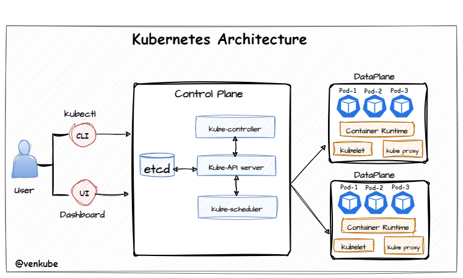

# Installation d'un cluster Kubernetes via kubeadm sur Debian 12

<p align="center">
  
</p>

- [Installation d'un cluster Kubernetes via kubeadm sur Debian 12](#installation-dun-cluster-kubernetes-via-kubeadm-sur-debian-12)
  - [Caractéristiques](#caractéristiques)
  - [Installation du noeud master (controlplane)](#installation-du-noeud-master-controlplane)
    - [Installer les composantes](#installer-les-composantes)
    - [Initialiser le cluster](#initialiser-le-cluster)
  - [Installation des noeuds worker](#installation-des-noeuds-worker)
    - [Installation des composantes](#installation-des-composantes)
    - [Rejoindre le cluster](#rejoindre-le-cluster)
  - [Accéder au cluster](#accéder-au-cluster)
    - [Installation de l'outil d'administration du cluster (kubectl)](#installation-de-loutil-dadministration-du-cluster-kubectl)
    - [Configuration de kubectl](#configuration-de-kubectl)
    - [Vérification de l'état du cluster](#vérification-de-létat-du-cluster)

Dans ce tutoriel, nous allons déployer un cluster Kubernetes sur un cluster local (*on premise*) sur une distribution Debian12.

## Caractéristiques

Le cluster a les caractéristiques suivantes:

| Composantes                              | Détails    |
| ---------------------------------------- | -----------|
| OS                                       | Debian12   |
| Méthode de déploiement                   | Kubeadm    |
| Container Runtime Interface (CRI)        | Containerd |
| Stockage des données internes du cluster | etcd       |
| Nombre de noeuds *master*                | 1          |
| Nombre de noeuds *worker*                | 3          |

## Installation du noeud master (controlplane)

### Installer les composantes

```bash
# Configurer la version à déployer des composantes du cluster
# Ces valeurs sont susceptibles d'être modifiées dans le futur pour rester à jour
VERSION=${VERSION:-"1.29.0"}
REPO_VERSION=1.29
ETCD_VERSION=v3.5.11
NERDCTL_VERSION=1.7.2

# Installer les dépendances utilisées par des services de Kubernetes (Longhorn par exemple)
sudo apt update
sudo apt install open-iscsi cryptsetup

# Désactiver lesm ises à jour automatique (pour éviter les mises à jour dangereuses pour le cluster)
(
sudo systemctl stop apt-daily.timer
sudo systemctl disable apt-daily.timer
sudo systemctl mask apt-daily.service
sudo systemctl stop apt-daily-upgrade.timer
sudo systemctl disable apt-daily-upgrade.timer
sudo systemctl mask apt-daily-upgrade.service
sudo systemctl daemon-reload
) 1>/dev/null 2>&1 || true

# Nettoyage de l'OS (en cas d'installation antérieure)
rm -rf $HOME/.kube
sudo kubeadm reset -f || true
sudo apt-mark unhold kubelet kubeadm kubectl || true
sudo apt-get remove -y containerd kubelet kubeadm kubectl kubernetes-cni || true
sudo apt-get autoremove -y
sudo systemctl daemon-reload

# Configuration des modules du kernel
sudo apt-get update
echo 1 | sudo tee /proc/sys/net/ipv4/ip_forward
sudo modprobe overlay
sudo modprobe br_netfilter

# NFS client (optionnel)
sudo apt-get install -y nfs-common

# Installation des paquets Kubernetes
# ATTENTION: Les répertoires Kubernetes sont propres à une version
# Si changement de version, il est nécessaire de mettre à jour le répertoire avec la version souhaitée
sudo apt-get update && sudo apt-get install -y apt-transport-https curl
curl -fsSL https://pkgs.k8s.io/core:/stable:/v${REPO_VERSION}/deb/Release.key | sudo gpg --dearmor -o /etc/apt/keyrings/kubernetes-apt-keyring.gpg
echo "deb [signed-by=/etc/apt/keyrings/kubernetes-apt-keyring.gpg] https://pkgs.k8s.io/core:/stable:/v${REPO_VERSION}/deb/ /" | sudo tee /etc/apt/sources.list.d/kubernetes.list
sudo apt-get update -y
sudo apt-get install -y kubelet kubeadm kubectl kubernetes-cni
sudo apt-mark hold kubelet kubeadm kubectl

# Installation de Containerd
sudo mkdir -p /etc/apt/keyrings
curl -fsSL https://download.docker.com/linux/debian/gpg | sudo gpg --dearmor -o /etc/apt/keyrings/docker.gpg
echo   "deb [arch=$(dpkg --print-architecture) signed-by=/etc/apt/keyrings/docker.gpg] https://download.docker.com/linux/debian \
  $(lsb_release -cs) stable" | sudo tee /etc/apt/sources.list.d/docker.list > /dev/null
sudo apt-get update
sudo apt-get install containerd.io -y

# Configurer Containerd
sudo mkdir -p /etc/containerd
sudo containerd config default | sudo tee /etc/containerd/config.toml
sudo sed -i 's/SystemdCgroup = false/SystemdCgroup = true/g' /etc/containerd/config.toml
# sudo nano /etc/containerd/config.toml set SystemdCgroup = true
sudo systemctl restart containerd

# Configurer crictl (outil de configuration du CRI Kubernetes) pour utiliser Containerd
# Par défaut, Kubernetes utilise Docker
cat <<EOF | sudo tee /etc/crictl.yaml
runtime-endpoint: unix:///run/containerd/containerd.sock
EOF

# Installer etcdctl / etcdutl pour manager la base etcd (notamment dans le cas d'une restauration)
ARCH=$(dpkg --print-architecture)
ETCD_RELEASE=etcd-${ETCD_VERSION}-linux-$ARCH
DOWNLOAD_URL=https://github.com/etcd-io/etcd/releases/download
wget -q ${DOWNLOAD_URL}/${ETCD_VERSION}/${ETCD_RELEASE}.tar.gz
tar xzf ${ETCD_RELEASE}.tar.gz
sudo mv ${ETCD_RELEASE}/etcdctl /usr/bin/
sudo mv ${ETCD_RELEASE}/etcdutl /usr/bin/
rm -rf ${ETCD_RELEASE} ${ETCD_RELEASE}.tar.gz

# Installer nerdctl pour pouvoir intéragir avec les déploiements Containerd
wget -q https://github.com/containerd/nerdctl/releases/download/v${NERDCTL_VERSION}/nerdctl-${NERDCTL_VERSION}-linux-${ARCH}.tar.gz
sudo tar Cxzvvf /usr/local/bin nerdctl-${NERDCTL_VERSION}-linux-${ARCH}.tar.gz
rm nerdctl-${NERDCTL_VERSION}-linux-${ARCH}.tar.gz
```

### Initialiser le cluster

```bash
sudo kubeadm init
```

A la fin de l'initialisation, vous obtiendrez un message sur la sortie standard (stdout) similaire à:

```bash
kubeadm join <IP> --token <TOKEN> --discovery-token-ca-cert-hash sha256:<HASH>
```

Cette commande permet aux noeuds *worker* de rejoindre le cluster une fois déployé. Si vous n'avez pas conservé la commande, vous pouvez en regénérer une via `sudo kubeadm token create --print-join-command`.

## Installation des noeuds worker

### Installation des composantes

```bash
# Configurer la version à déployer des composantes du cluster
# Ces valeurs sont susceptibles d'être modifiées dans le futur pour rester à jour
VERSION=${VERSION:-"1.29.0"}
REPO_VERSION=1.29
ETCD_VERSION=v3.5.11
NERDCTL_VERSION=1.7.2

# Installer les dépendances utilisées par des services de Kubernetes (Longhorn par exemple)
sudo apt update
sudo apt install open-iscsi cryptsetup

# Désactiver lesm ises à jour automatique (pour éviter les mises à jour dangereuses pour le cluster)
(
sudo systemctl stop apt-daily.timer
sudo systemctl disable apt-daily.timer
sudo systemctl mask apt-daily.service
sudo systemctl stop apt-daily-upgrade.timer
sudo systemctl disable apt-daily-upgrade.timer
sudo systemctl mask apt-daily-upgrade.service
sudo systemctl daemon-reload
) 1>/dev/null 2>&1 || true

# Nettoyage de l'OS (en cas d'installation antérieure)
rm -rf $HOME/.kube
sudo kubeadm reset -f || true
sudo apt-mark unhold kubelet kubeadm kubectl || true
sudo apt-get remove -y containerd kubelet kubeadm kubectl kubernetes-cni || true
sudo apt-get autoremove -y
sudo systemctl daemon-reload

# Configuration des modules du kernel
sudo apt-get update
echo 1 | sudo tee /proc/sys/net/ipv4/ip_forward
sudo modprobe overlay
sudo modprobe br_netfilter

# NFS client (optionnel)
sudo apt-get install -y nfs-common

# Installation des paquets Kubernetes
# ATTENTION: Les répertoires Kubernetes sont propres à une version
# Si changement de version, il est nécessaire de mettre à jour le répertoire avec la version souhaitée
sudo apt-get update && sudo apt-get install -y apt-transport-https curl
curl -fsSL https://pkgs.k8s.io/core:/stable:/v${REPO_VERSION}/deb/Release.key | sudo gpg --dearmor -o /etc/apt/keyrings/kubernetes-apt-keyring.gpg
echo "deb [signed-by=/etc/apt/keyrings/kubernetes-apt-keyring.gpg] https://pkgs.k8s.io/core:/stable:/v${REPO_VERSION}/deb/ /" | sudo tee /etc/apt/sources.list.d/kubernetes.list
sudo apt-get update -y
sudo apt-get install -y kubelet kubeadm kubectl kubernetes-cni
sudo apt-mark hold kubelet kubeadm kubectl

# Installation de Containerd
sudo mkdir -p /etc/apt/keyrings
curl -fsSL https://download.docker.com/linux/debian/gpg | sudo gpg --dearmor -o /etc/apt/keyrings/docker.gpg
echo   "deb [arch=$(dpkg --print-architecture) signed-by=/etc/apt/keyrings/docker.gpg] https://download.docker.com/linux/debian \
  $(lsb_release -cs) stable" | sudo tee /etc/apt/sources.list.d/docker.list > /dev/null
sudo apt-get update
sudo apt-get install containerd.io -y

# Configurer Containerd
sudo mkdir -p /etc/containerd
sudo containerd config default | sudo tee /etc/containerd/config.toml
sudo sed -i 's/SystemdCgroup = false/SystemdCgroup = true/g' /etc/containerd/config.toml
# sudo nano /etc/containerd/config.toml set SystemdCgroup = true
sudo systemctl restart containerd

# Configurer crictl (outil de configuration du CRI Kubernetes) pour utiliser Containerd
# Par défaut, Kubernetes utilise Docker
cat <<EOF | sudo tee /etc/crictl.yaml
runtime-endpoint: unix:///run/containerd/containerd.sock
EOF

# Installer nerdctl pour pouvoir intéragir avec les déploiements Containerd
wget -q https://github.com/containerd/nerdctl/releases/download/v${NERDCTL_VERSION}/nerdctl-${NERDCTL_VERSION}-linux-${ARCH}.tar.gz
sudo tar Cxzvvf /usr/local/bin nerdctl-${NERDCTL_VERSION}-linux-${ARCH}.tar.gz
rm nerdctl-${NERDCTL_VERSION}-linux-${ARCH}.tar.gz
```

### Rejoindre le cluster

Exécuter la commande affichée sur la sortie standard lors de l'initialisation du cluster via le noeud *master* ou via la commande `sudo kubeadm token create --print-join-command`.

## Accéder au cluster

### Installation de l'outil d'administration du cluster (kubectl)

```bash
VERSION=$(curl -s https://storage.googleapis.com/kubernetes-release/release/stable.txt)
curl -LO https://storage.googleapis.com/kubernetes-release/release/$VERSION/bin/linux/amd64/kubectl
chmod +x ./kubectl
sudo mv ./kubectl /usr/local/bin/kubectl
```

**Note**: Le cluster peut être atteint depuis un autre hôte que le noeud master.

### Configuration de kubectl

Lors de la création du cluster, un fichier `kubeconfig` a été crée permettant un accès administrateur au cluster. Le chemin de ce fichier est `/etc/kubernetes/admin.conf`. `kubectl` lit la variable d'environnement `KUBECONFIG` pour obtenir le fichier de droit d'accès au cluster. De ce fait, éditer votre fichier `~/.bashrc` avec:

```bash
# Vous n'êtes pas obligé d'exécuter la commande via le noeud master.
# Tout hôte disposant de kubectl, d'une capacité d'atteinte d'un des noeuds du cluster et du fichier de configuration valide peut intéragir avec le cluster
export KUBECONFIG=<PATH_OF_ADMIN.CONF>
```

**IMPORTANT**: Le fichier `kubeconfig` (`/etc/kubernetes/admin.conf`) donne l'ensemble des droits administrateurs du cluster. Il est donc particulièrement sensible et doit être sécurisé. Il est possible de générer d'autres fichiers `kubeconfig` afin de donner des droits restreints au cluster pour différents types d'utilisateur.

### Vérification de l'état du cluster

Depuis un hôte possédant `kubectl` et un fichier `kubeconfig` valide, exécutez la commande `kubectl get nodes`. Vous devriez obtenir un message similaire à:

```bash
NAME           STATUS      ROLES           AGE     VERSION
controlplane   NotReady    control-plane   5h23m   v1.29.0
worker0        NotReady    <none>          4h21m   v1.29.0
worker1        NotReady    <none>          4h21m   v1.29.0
worker2        NotReady    <none>          4h21m   v1.29.0
{...}
```

L'indication `NotReady` est normale. En effet, pour être pleinement fonctionnel, le cluster nécessite d'avoir un *Container Network Interface* (CNI) déployé dans le cluster. Ce déploiement dépasse le cadre de ce tutoriel qui ne couvre que l'installation-même du cluster et non son administration.
